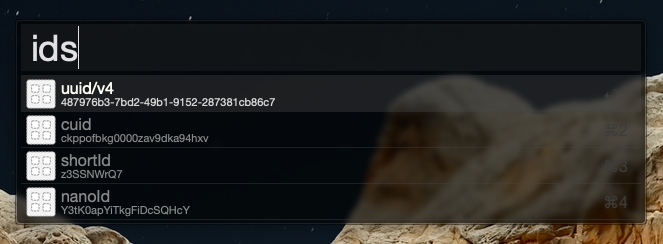

# alfred-ids

> [Alfred](https://www.alfredapp.com/) workflow - id generator

Generates ids from various projects and copies them to your clipboard.



## Install

```
$ npm install -g alfred-ids
```

## Usage

In Alfred, type `ids` and select the id you want to copy to your clipboard.

## Related

- [alfy](https://github.com/sindresorhus/alfy) - Create Alfred workflows with ease
